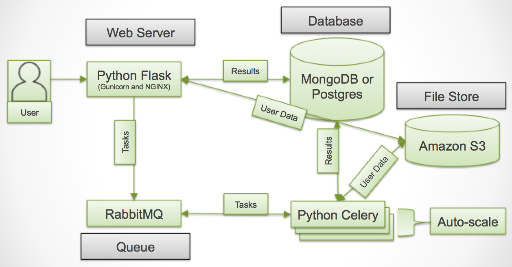

# Centaurus: K-Means as a Service
Centaurus is a scalable, easy to use, cloud service for k-means clustering that
automatically deploys and executes multiple k-means variants concurrently, and
then scores them to provide a clustering recommendation. Centaurus scores
clustering results using Bayesian Information Criterion to determine the best
model fit across cluster results. Visualization and diagnostic tools are
available to help users interpret clustering results.

Authors: Angad Gill, Nevena Golubovic

## Architecture
The system consists of a total of five services:
- _Frontend_: The frontend is provided by a Python Flask server
     (`site/frontend.py`) paired with Gunicorn and NGINX.
- _Backend_: There are two options for the backend:  
  1. Worker: Python Celery to perform all analysis tasks asynchronously
     (`site/worker.py`).
  2. Queue: RabbitMQ as a message broker between the Frontend and
     Workers.
  3. Database: Centaurus can be used with either NoSQL (MongoDB) or
   SQL (Postgres) to store all parameters for analysis and results of
   all tasks associated with each analysis.
  4. Storage: Amazon S3 to store the data files uploaded by users.

  

## Purpose
The purpose of the _Frontend_ is to do the following:
1. Provide an interface for users to upload their data files to the Backend
Storage.
2. Provide an interface for users to view the status and results of the
analysis.
3. Generate all the tasks (individual k-means fit runs) needed to complete
a job.
4. Generate necessary plots and tables needed for 1. and 2.  
5. Allow users to rerun tasks that failed.

The purpose of the _Backend Worker_ is to do the following:
1. Run the analysis based on the data and parameters provided in the
   Backend Queue.
2. When done, update the Backend Database with the analysis results.  

## Installation  
See `site/README.md`.

## Publications:
N. Golubovic, A. Gill, C. Krintz, R. Wolski,
["CENTAURUS: A Cloud Service for K-means Clustering"](http://www.cs.ucsb.edu/~ckrintz/papers/centaurus_datacom.pdf),
2017 IEEE 15th Intl Conf on Dependable, Autonomic and Secure Computing, 15th
Intl Conf on Pervasive Intelligence and Computing, 3rd Intl Conf on Big Data
Intelligence and Computing and Cyber Science and Technology Congress
