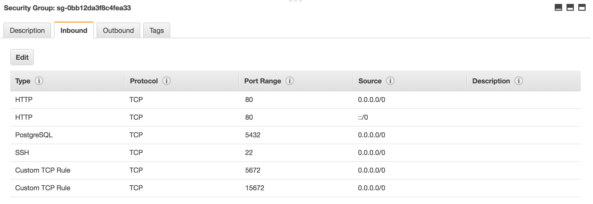

## Production Server Setup from Scratch
The following components can all be installed on one machine or each can
have its own separate server to allow for more scalability.
Documentation below uses Eucalyptus cloud and was tested on OpenStack
and AWS.

1. Frontend  
2. Backend Queue  
3. Backend Worker  
4. Backend Database  
5. Backend File Store: Eucalyptus S3 is used for this. Eucalyptus access
 key is required to make this work.

Backend-Worker server can be setup so that it can auto-scale behind a
load-balancer. For more details scroll to the end.

Instructions differ for Ubuntu 14 and Ubuntu 16.

### Backend

* Create a security group for all EC2 instance with the following ports open:
`TCP 22`, `TCP 80`, `TCP 5432`, `TCP 5672`,  and, optionally, `TCP 15672`.



#### Queue 

1. Create an Ubuntu Server 18.04 LTS instance
(AWS EC2: Ubuntu Server 18.04 LTS (HVM), SSD Volume Type - ami-0bbe6b35405ecebdb). **Configure security group as the one created above.**

2. Login to the instances:
```bash
ssh -i <key_file>.pem ubuntu@<instances IP>
```
3. Update packages:
```bash
sudo apt-get -y update && sudo apt-get -y upgrade
```
4. Install RabbitMQ Server:
```bash
sudo apt-get install -y rabbitmq-server
```
5. Install NTP to sync clock:
```bash
sudo apt-get install -y ntp
```
6. [Optional] Enable management plugin so you can use web UI available
at port `15672`:
```bash
sudo rabbitmq-plugins enable rabbitmq_management
sudo service rabbitmq-server restart
```
7. Create users:
```bash
sudo rabbitmqctl add_user admin <set_your_password_here>
sudo rabbitmqctl set_user_tags admin administrator
sudo rabbitmqctl add_user kmeans <set_your_password_here>
sudo rabbitmqctl set_permissions -p / kmeans ".*" ".*" ".*"
```
8. Restart RabbitMQ:
```bash
sudo service rabbitmq-server restart
```

#### Database

1. Create an Ubuntu Server 18.04 LTS instance
(AWS EC2: Ubuntu Server 18.04 LTS (HVM), SSD Volume Type - ami-0bbe6b35405ecebdb). **Configure security group as the one created above.**

2. Login to the instances:
```bash
ssh -i <key_file>.pem ubuntu@<instances IP>
```
3. Update packages and install NTP to sync clock:
```bash
sudo apt-get -y update && sudo apt-get -y upgrade && sudo apt-get install -y ntp
```
4. Install Postgres ([official guide](https://www.postgresql.org/docs/current/static/tutorial-install.html)):
```bash
sudo apt-get -y install postgresql postgresql-contrib
```

`Note`: There are four system users we will use below:
**root**, **ubuntu**, **postgres**, and **kmeans**;
and two database users: **postgres** and **kmeans**.
When logged into the machine, you will see the system username
in front of the `@` sign; when logged into the database, you will see
the database username in front of the `#` sign.

5. Create the Database:
Create database
```bash
# logged in as an ubuntu@euca user, create db as a postgresuser:
sudo -i -u postgres createdb kmeans
```

6. Setup users:
 - after logging in as ubuntu user, create kmeans user:
```bash
sudo adduser kmeans
```
 - test the login
```bash
sudo -i -u kmeans
exit # (back to ubuntu user)
```
 - create postgres kmeans user
```bash
sudo -i -u postgres
createuser --interactive
name:kmeans
role (superuser): y
```
 - set the password
```bash
psql
alter user kmeans with encrypted password 'y0ur_passw0rd';
# exit the database
\q
```
 - test the login
```bash
psql -h localhost  -U kmeans -d kmeans
# exit the database
\q
# exit the postgres user back to ubuntu@
exit
```

8. Setup config:
 - Open up `/etc/postgresql/your_pg_version/main/pg_hba.conf`
```bash
sudo vi /etc/postgresql/your_pg_version/main/pg_hba.conf
```
 - Change the existing permissions to the following lines:
```bash
local all all   trust
host all all 0.0.0.0/0 md5
```
 - Open `/etc/postgresql/your_pg_version/main/postgresql.conf`
```bash
sudo vi /etc/postgresql/your_pg_version/main/postgresql.conf
```
 - Set the following parameters:
```bash
listen_addresses = '*'
max_connections = 10000
```

9. Create the tables
```bash
# switch user to kmeans@
sudo -i -u kmeans
# switch db user to kmeans#
psql
# create tables
CREATE TABLE job (
    job_id serial PRIMARY KEY,
    n_experiments int NOT NULL,
    max_k int NOT NUll,
    n_init int NOT NULL,
    n_tasks int NOT NULL,
    columns text[],
    filename varchar (100) NOT NULL,
    start_time timestamp with time zone,
    scale boolean,
    s3_file_key varchar (200) NOT NULL
);
```
```bash
CREATE TABLE task (
    id serial PRIMARY KEY,
    task_id int,
    job_id serial,
    n_experiments int NOT NULL,
    max_k int,
    n_init int NOT NULL,
    n_tasks int,
    columns text[],
    filename varchar (100),
    start_time timestamp with time zone,
    scale boolean,
    s3_file_key varchar (200) NOT NULL,
    k int NOT NULL,
    covar_type varchar(25) check (covar_type in ('full', 'diag', 'spher')),
    covar_tied boolean,
    task_status varchar(25) check (task_status in ('pending', 'done', 'error')),
    task_index int,
    aic numeric,
    bic numeric,
    labels int[],
    cluster_counts int[],
    centers numeric[],
    cluster_count_minimum int,
    elapsed_time int,
    iteration_num int,
    elapsed_read_time int,
    elapsed_processing_time int
);
# exit the database
\q
# exit the kmeans user back to ubuntu@
exit
```

10. Run Postgres:
```bash
sudo systemctl restart postgresql.service
```

11. Other useful commands for backup and debugging:
```bash
# as ubuntu@
sudo systemctl status postgresql.service
# backup the databse as either kmeans# or postgres#
pg_dump kmeans >  kmeans_backup.out
# check the log as ubuntu@
less  /var/log/postgresql/postgresql-10-main.log
# connect from your local machine to the database:
psql -h <your-DB-IP> -U kmeans -d kmeans
```


### File Store
1. Login to [AWS S3]
2. Click on "Create Bucket".
3. Give it a unique name and click on "Create Bucket".


#### Worker

1. Create an Ubuntu Server 18.04 LTS instance
(AWS EC2: Ubuntu Server 18.04 LTS (HVM), SSD Volume Type - ami-0bbe6b35405ecebdb). **Configure security group as the one created above.**

2. Login to the instance:
```bash
ssh -i <key_file>.pem ubuntu@<instances IP>
```
3. Update packages, install NTP and required packages:
```bash
sudo apt-get -y update && sudo apt-get -y upgrade && sudo apt-get install -y ntp && sudo apt-get install -y python-virtualenv python3-tk git
```
4. Clone the repo:
```bash
git clone https://github.com/MAYHEM-Lab/kmeans-service.git
```
5. Install required Python packages:
```bash
cd ~/kmeans-service/site
virtualenv venv --python=python3
source venv/bin/activate
pip install pip --upgrade
pip install -r requirements.txt
```
6. Configure worker service:
```bash
#if using systemd - Ubuntu 18.04
sudo cp /home/ubuntu/kmeans-service/site/util/worker.service /etc/systemd/system/
sudo cp /home/ubuntu/kmeans-service/site/util/celery-teardown.sh /usr/sbin/
```
9. Set (or replace) values in `config.py`:
```
CELERY_BROKER = 'amqp://kmeans:<password>@<RabbitMQ-IP>:5672//'
POSTGRES_URI = 'postgres://kmeans:passwd@<Postgres-IP>:5432/kmeans'
S3_BUCKET = '<unique_s3_bucket_name>'
```
10. Run the server:  
```bash
#if using systemd - Ubuntu 18.04
sudo systemctl start worker
```

### Frontend
1. Create an Ubuntu Server 18.04 LTS instance
(AWS EC2: Ubuntu Server 18.04 LTS (HVM), SSD Volume Type - ami-0bbe6b35405ecebdb). **Configure security group as the one created above.**
2. Login to the instances:
```bash
ssh -i <key_file>.pem ubuntu@<instances IP>
```
3. Update packages: . Install NTP to sync clock:Install required Ubuntu
packages:
```bash
sudo apt-get -y update && sudo apt-get -y upgrade && sudo apt-get install -y ntp && sudo apt-get install -y nginx python-virtualenv python3-tk git
```
4. Clone this repo:
```bash
git clone https://github.com/MAYHEM-Lab/kmeans-service.git
```
5. Install required Python packages:
```bash
cd ~/kmeans-service/site
virtualenv venv --python=python3
source venv/bin/activate
pip install pip --upgrade
pip install -r requirements.txt
```
6. Configure NGINX:
```bash
sudo /etc/init.d/nginx start
sudo rm /etc/nginx/sites-enabled/default
sudo cp conf/nginx.conf /etc/nginx/sites-available/kmeans_frontend
sudo ln -s /etc/nginx/sites-available/kmeans_frontend /etc/nginx/sites-enabled/kmeans_frontend
sudo /etc/init.d/nginx restart
```
7. Create directory for logs:
```bash
mkdir /home/ubuntu/logs
mkdir /home/ubuntu/logs/gunicorn
touch /home/ubuntu/logs/gunicorn/error.log
```
8. Configure frontend service:
```bash
#if using systemd - Ubuntu 18.04
sudo cp /home/ubuntu/kmeans-service/site/util/frontend.service /etc/systemd/system/
```
9. Generate a secret key for the Flask server:
```bash
python
>>> import os
>>> os.urandom(24)
'\xcf6\x16\xac?\xdb\x0c\x1fb\x01p;\xa1\xf2/\x19\x8e\xcd\xfc\x07\xc9\xfd\x82\xf4'
```
10. Set (or replace) values in `kmeans-service/site/config.py`:
```
FLASK_SECRET_KEY = <secret key generted in 10.>
CELERY_BROKER = 'amqp://kmeans:<password>@<RabbitMQ-IP>:5672//'
POSTGRES_URI = 'postgres://kmeans:passwd@<Postgres-IP>:5432/kmeans'
S3_BUCKET = '<unique_s3_bucket_name>'
```
11. Run the server:
```bash
#if using systemd - Ubuntu 18.04
sudo systemctl start frontend
```

**TODO - Autoscaling for AWS**

## Setting up auto-scaling for Backend Workers
Follow these instructions to setup auto-scaling on
[Aristole](https://console.aristotle.ucsb.edu) for the Backend Workers,
after completing the setup above. Note the parallel Ubuntu 14 vs 16 commands.

### 1. Create an Image
1. SSH to the Backend Worker instance and run the following commands to
prepare it for image creation:
```bash
sudo service worker stop //systemd: sudo systemctl stop worker 
sudo rm -f /var/log/upstart/worker.log 
sudo rm -f /etc/init/worker.conf
sudo service frontend stop  //systemd: sudo systemctl stop frontend
sudo rm -f /etc/init/frontend.conf
sudo rm -rf /home/ubuntu/logs/
sudo apt-get update; sudo apt-get -y upgrade; sudo apt-get -y dist-upgrade; sudo apt-get -y autoremove
sudo apt-get -y install tzdata ntp zip unzip curl wget cvs git python-pip build-essential
dpkg-reconfigure tzdata
sudo rm -f /etc/udev/rules.d/70*-net.rules
sudo rm -rf /root/linux-rootfs-resize*
sudo rm -rf /root/euca2ools*
sudo rm -rf /var/lib/cloud/instance /var/lib/cloud/instances/i*
rm -f ~/.bash_history
#remove all keys and credentials also!
```
2. Go to the
[Instances page](https://console.aristotle.ucsb.edu/instances)
and find the instance.
3. In the "Actions" column, click on the ellipses ("...") and select
"Create image".
4. Type an appropriate name, select a bucket (or create a new one), and
click "Create Image".
5. Once the image is created successfully, note down the image ID (AMI).


### 2. Create a Launch Configuration
1. Go to the
[Launch Configurations](https://console.aristotle.ucsb.edu/launchconfigs)
and click on "Create New Launch Configuration".
2. Search for the image create earlier by name or by the AMI and click
"Select".
3. Type an appropriate name and select c1.xlarge instance type.
4. Under "User data", select "Enter Text" and paste the following into the text
 box under it:
```bash
#!/bin/bash
sudo cp /home/ubuntu/kmeans-service/site/conf/worker.conf /etc/init/worker.conf
sudo service worker start
```
5. Click "Next"
6. Select key pair that will be used with these instance and select a security
group that has `TCP` port `22` open.
7. Click "Create Launch Configuration"

### 3. Create an Auto-Scale Group
1. Go to the
[Scaling Groups page](https://console.aristotle.ucsb.edu/scalinggroups) and
click on "Create New Scaling Group".
2. Type an appropriate name, set the "Max" to `5`, and click "Next". 
3. Set the "Availability zone(s)" to "race" and click "Create Scaling Group".
This will redirect to the page for the configuration.
4. Create a policy to scale up that triggers when the average CPU utilization
for the group is over 25% for 1 minute:
    1. Select the "Scaling Policies" tab and click on "ADD A SCALING POLICY".
    2. Type an appropriate name, e.g., "scale-up-25-per-1-min".
    3. Under "Action", select "Scale up by".
    4. Under "Alarm", click on "Creat alarm".
    5. In the pop-up modal window:
        1. Type an appropriate name, e.g., "25-per-1-min"
        2. In the drop down box next to "When the", select "Average"
        3. In the drop down box next to "Average", select "AWS/EC2 -
           CPUUtilization"
        4. In the drop down next to "for", select "Scaling group"
        5. In the drop down next to "Scaling group", select the name of the
            scaling group being created in this setup.
        6. In the drop down box next to "is", select ">="
        7. In the text box for "amount..." type `25`.
        8. In the text box next to "with each measurement lasting", type `1`
    6. Click on "Create Alarm" and then on "Create Scaling Policy".
5. Create a policy to scale down that triggers when the average CPU utilization
   for the group is under 10% for 5 minutes:
    1. Select the "Scaling Policies" tab and click on "ADD A SCALING POLICY".
    2. Type an appropriate name, e.g., "scale-down-10-per-5-min".
    3. Under "Action", select "Scale down by".
    4. Under "Alarm", click on "Crete alarm".
    5. In the pop-up modal window:
        1. Type an appropriate name, e.g., "10-per-5-min"
        2. In the drop down box next to "When the", select "Average"
        3. In the drop down box next to "Average", select "AWS/EC2 -
           CPUUtilization"
        4. In the drop down next to "for", select "Scaling group"
        5. In the drop down next to "Scaling group", select the name of the
           scaling group being created in this setup.
        6. In the drop down box next to "is", select "<"
        7. In the text box for "amount..." type `10`.
        8. In the text box next to "with each measurement lasting", type `5`
    6. Click on "Create Alarm" and then on "Create Scaling Policy".
